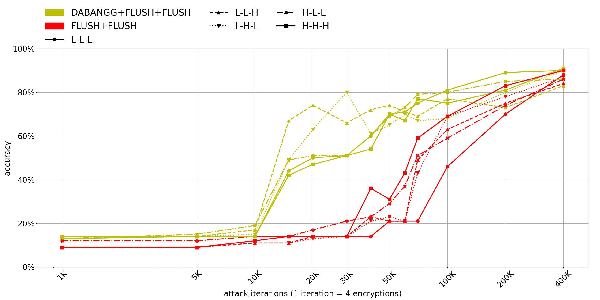

# AES Private Key Extraction

Code adapted from [nepoche/Flush-Reload](https://github.com/nepoche/Flush-Reload).

In this experiment, we will extract the AES private key by making repeated encryption calls to a separate server process. This experiment does not require supervisor privileges as the OpenSSL library is installed locally.

## OpenSSL Installation

Follow the steps to locally install the vulnerable T-Tables implementation of AES cryptosystem:

1. `cd openssl-1.1.0f`
2. `mkdir -p openssl-1.1.0f/build`
3. `./config -d shared no-asm no-hw --prefix=$PWD/build`
4. `make; make install_sw`

## Pre-Attack Steps

Perform DABANGG calibration by following the steps outlined in [calibration](../calibration).

### Update Attacker programs

A flush-based attack monitors cache lines. To monitor the correct cache lines, we must find the offset of addresses of the T-tables
with respect to the **libcrypto.so** shared object. To find this, perform the following commands:

1. `cd openssl-1.1.0f/build/lib`
2. `readelf -a libcrypto.so > aeslib.txt`
3. `vi aeslib.txt`
4. Enter `/Te0` in vim to get offset of Te0, `<Te0-offset>`. Similar, get the other 3 offsets using `/Te1`, `/Te2`, `/Te3`.
5. Update `probe` array in `dfr.cpp` or `dff.cpp` as follows (`base` is a runtime variable, don't change it):
```
char* probe[] = { 
base + <Te0-offset>, base + <Te1-offset>, base + <Te2-offset>, base + <Te3-offset>
};
```
6. Update `step_width`, `T_ARRAY_SIZE`, `tl_array` and `th_array` in `dfr.cpp` or `dff.cpp` as per calibration results.
7. Update `flush_flush_threshold` and `flush_reload_threshold` using baseline calibration results in `dff.cpp` and `dfr.cpp`, respectively. It is OK to not update these thresholds as the program will use the appropriate threshold from the array of thresholds obtained using DABANGG calibration.

## Compile

1. `export LD_LIBRARY_PATH=$PWD/openssl-1.1.0f/build/lib`
2. `make`

## Run using the script (Recommended)

The usage of `run_exp.sh` is: `./run_exp.sh <dff-or-dfr>`. To run DABANGG+FLUSH+RELOAD attack and the baseline FLUSH+RELOAD attack, use the command `./run_exp.sh dfr`.

**Note:** To ensure the calibration is done correctly, we recommend running the `test_run_exp.sh` script first which will finish execution within a few minutes. Then, plot the figure and if an upward trend in accuracy is not visible, try the tips in the troubleshooting section. 



The `run_exp.sh` script produces the output present in Figure 6 (shown above for D+F+F and F+F). Specifically, it runs for all attack iterations (shown on the x-axis), running each iteration for all selected noise levels (shown in legend) and averages over 10 runs for each combination of noise and iterations (we averaged over 1000 runs for each combination in the paper). Overall, the script takes a few hours to run. 

The script is parameterized and number of iterations, noise levels, and runs-per-combination (to take the average) can all be easily modified. Please see the script comments for more info.

### Plotting the Figure

After running the script for D+F+Fand F+F, plot the graph using the command:
```
python plot.py dff
```

Note that `matplotlib` library is required for plotting. It should approximately recreate the figure shown above. We are interested in the general trend towards higher accuracy as the number of iterations (and hence encryption calls) increase for various noise levels and how well D+F+F performs compared to F+F.

Repeat the steps to run D+F+R and F+R as follows:

1. `./run_exp.sh dfr`
2. `python plot.py dfr`

## Manual run (Useful for Debugging)

`dfr` and `dff` binaries accept 2 arguments as follows `./dff <iterations> <run_baseline_attack>`.

`<iterations>` is the number of attack iterations, each of which makes 4 encryption calls. The second argument is optional and is used to run the baseline Flush+Flush (or Flush+Reload in case of D+F+R) attack. 

**Setting baseline attack threshold:** The baseline attack threshold can be set at runtime by providing the threshold as the second argument. 

For example, if the baseline calibration yields a F+F threshold of 100, we can run a baseline F+R attack for 10K iterations using the following command:
```
# The server needs to run first to respond to attacker's requests
./server > /dev/null 2>&1 &
sleep 0.5
./dfr 10000 100
```

### Noise generation

The `dabangg_noise` program systematically generates compute, memory, and IO-intensive noise. As we cannot supply SPEC's `mcf` benchmark that we used in the paper publicly, we instead of use code adapted from `stress` tool (available in Ubuntu) to generate memory noise by writing to a large mmeory region in random fashion. 

The program takes 3 arguments that are knobs on whether to generate Compute, Memory, and IO noise. For example, to generate the 'H-L-H' noise level (recall the C-M-I nomenclature), run the program as follows:

```
./dabangg_noise 1 0 1
```

### Results

The output of the program is the secret key of the server process. The actual secret key is `0x1122334455667788ff00eeddccbbaa99`. While this program is best run in an automated manner using the `run_exp.sh` script as specified above, if one needs to compute the accuracy of the secret key emitted by the program, follow the steps:

Let's say the `dfr` program output looks as follows:
```
Socket successfully created..
connected to the server..
KEY d792a0fb46d6cd1e97849907e3ab9512
```
1. Copy the value after `KEY`, which is in this case is `d792a0fb46d6cd1e97849907e3ab9512` to a file named `computed_keys.dfr`.

2. `python calc_accuracy.py dfr` will output the percentage-accuracy.

## Troubleshooting

### Compilation and linking issues

1. Use `ldd server` command to ensure that `libcrypto.so.1.1` is linked to the library that we compiled and not to a library in `/usr/` or `/usr/local/`.

2. Ensure the `LD_LIBRARY_PATH` is correctly exported before running any programs.

### Poor accuracy

1. Visit troubleshooting guidelines in [calibration](../calibration).

2. Ensure the `tl_array` and `th_array` values are in descending order (as per output of calibration script).

3. Recalibrate while running the `dabangg_noise` process in background. To do this, follow the steps:
    * `./dabangg_noise 1 1 1 &`
    * Perform calibration.
    * `pkill dabangg_noise`

Please feel free to reach out to us if some issue is unresolved. 